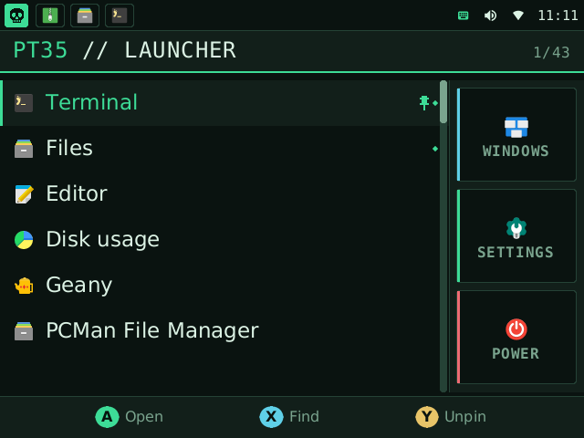
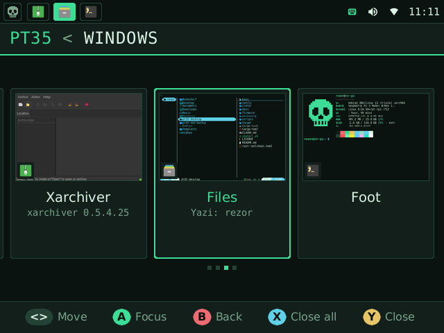
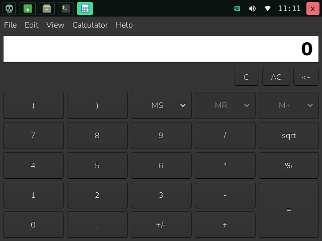
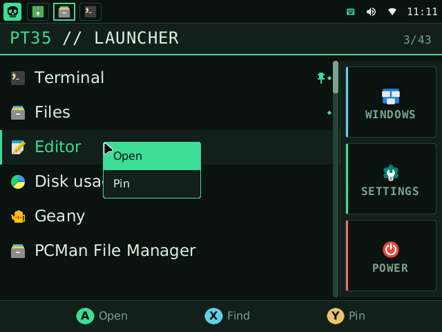
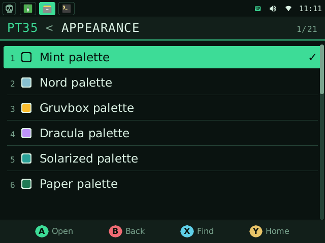

<div align="center">

# pt35-desktop

**A pocket desktop for the Waveshare PocketTerm35.**

Built for a 640x480 screen, a thumb keyboard and a D-pad.<br>
Real Linux apps, one per screen, no tiny windows.

[](https://github.com/therezor/PocketTerm35-OS/actions/workflows/ci.yml)
[](https://github.com/therezor/PocketTerm35-OS/releases/latest)
[](LICENSE)



</div>

## Why

Raspberry Pi OS Desktop expects a big screen and a mouse. On a 3.5" panel its
windows do not fit and its title bars eat the screen.

pt35-desktop gives every app the whole screen, and puts everything else in one
menu you drive with the D-pad. A mouse works too, built in or plugged in.

<table>
<tr>
<td></td>
<td></td>
</tr>
<tr>
<td align="center">Window switcher, with a picture of each window</td>
<td align="center">One app owns the screen. The taskbar stays on top.</td>
</tr>
<tr>
<td></td>
<td></td>
</tr>
<tr>
<td align="center">Right click a row for more</td>
<td align="center">Six colour palettes, applied to GTK and Qt apps too</td>
</tr>
</table>

## Features

- **Launcher.** Every installed app, recents and pins on top. Type to search.*
- **Taskbar.** One icon per open window. Tap one to switch.
- **Window switcher.** Cards with a live picture of each window.
- **Two input modes.** Buttons mode drives menus and apps with the D-pad.
  Mouse mode turns the D-pad into a cursor. R switches.
- **Mouse and touch.** Hover, click, right click, wheel, and breadcrumbs to go back.
- **Quick settings.** Wi-Fi, Bluetooth, volume, brightness*, input mode, touch.
- **Network.** Wi-Fi list and Ethernet.
- **CPU profiles.** Powersave, balanced and performance.
- **Fast.** Plain Rust, drawn in software. The menu opens in about 75ms on a Pi 5.

\* With the patched keyboard firmware (install step 2).

It is a real graphical desktop. sway draws the screen and XWayland runs X11
apps, so GTK, Qt and X11 programs work as normal.

## Install

You need a PocketTerm35 with a Pi 4B or Pi 5, and **Raspberry Pi OS (Trixie)
64-bit**. Lite is best. Bookworm is not supported.

**1. Install.** On the device:

```sh
curl -fsSL https://raw.githubusercontent.com/therezor/PocketTerm35-OS/main/install.sh | sudo bash
```

This downloads the latest release and installs it with all its dependencies.
It also sets up the screen, touch, login and the udev rules.

**2. Flash the keyboard firmware.** Recommended.

```sh
sudo pt35-kbd flash
```

Stock firmware makes A B X Y L R send the letters `a b x y l r`, so the shell
cannot tell a button from a key. The new keymap gives the buttons keys of their
own, and adds screen brightness control. Undo it with `sudo pt35-kbd restore`.
See [firmware/README.md](firmware/README.md).

**3. Reboot.**

```sh
sudo reboot
```

You log in straight to the desktop.

### Update, remove, build

| to | run |
|---|---|
| update | the install command again |
| remove | `curl -fsSL https://raw.githubusercontent.com/therezor/PocketTerm35-OS/main/install.sh \| sudo bash -s -- --uninstall` |
| build from a checkout | `sudo ./install.sh --from-source` (needs rustup) |
| see what it would do | add `--dry-run` |

Removing puts the old login back and leaves your files in `~/.config` alone.
Reboot after.

The installer also sets up the Files app (yazi) and its icon font. Installing
the `.deb` by hand skips that.

## Controls

| button | Buttons mode | Mouse mode |
|---|---|---|
| D-pad | arrows | move the cursor |
| A | Enter | left click |
| B | Escape | right click |
| X | Tab | scroll up |
| Y | F10 (the app's menu bar) | scroll down |
| L | close the window | close the window |
| R | switch to Mouse mode | switch to Buttons mode |
| Start | menu | menu |
| Select | window switcher | window switcher |

In the menu: A opens, B goes back, X searches, Y pins an app or goes home.
With a mouse: hover selects, click opens, right click shows more, the wheel
scrolls, and the path in the header takes you back.

| keys | what it does |
|---|---|
| `Super`+`Space` | menu |
| `Super`+`Enter` | new terminal |
| `Super`+`1`...`9` | go to that workspace |
| `Super`+`q` | close the window |
| `Super`+`f` | fullscreen (hides the bar) |
| `Super`+`s` | screenshot |
| Fn+Select | screenshot (patched firmware) |

All keys: [docs/KEYS.md](docs/KEYS.md).

## Configure

Defaults live in `/usr/share/pt35-desktop/pt35/`. Put your own copy in
`~/.config/pt35/`: it is merged over the defaults, table by table.

| file | controls |
|---|---|
| `menu.toml` | the menu: pages, apps, commands |
| `apps.toml` | each app: command, workspace, scale, environment |
| `theme.toml` | colours, fonts, sizes, icons |
| `hooks/hook_*` | scripts run at startup, app launch, shutdown |

Settings > Appearance writes `~/.config/pt35/appearance.toml` for you.

An app that is too big for 640x480 gets `scale = 0.75` in `apps.toml`. The app
draws smaller. The desktop does not.

More: [GUI apps](docs/gui-apps.md), [hardware facts](docs/hardware-facts.md).

## If something goes wrong

| problem | try |
|---|---|
| the menu will not open | `Super`+`Space` |
| the buttons do nothing | flash the firmware (install step 2), or touch the screen |
| the whole desktop is stuck | `sudo systemctl restart greetd` over SSH |
| you want the logs | `/run/user/1000/pt35/sway.log` |

The CPU profiles in Settings are tuned for the Pi 5. Performance needs a 27W
supply: the Pi browns out under load on a small one.

## How it works

```
sway (Wayland + XWayland)
 |
 +-- pt35d       session daemon: windows, input modes, hardware, status
 +-- pt35-bar    the 34px taskbar
 +-- pt35-menu   launcher, switcher, settings, power
 +-- pt35ctl     the command every key binding calls
```

No GTK, Qt or GL in the shell itself. It fits a 2 GB Pi.

## Licence

MIT. The device-tree overlays in `boot/` are Waveshare's, unchanged. See
[boot/README.md](boot/README.md).
